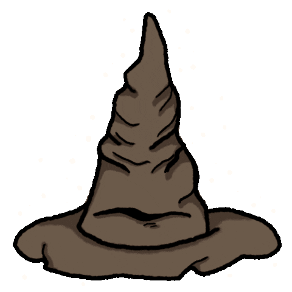

# ⚡ LE CHOIXPEAU MAGIQUE 

<p align="center">
  
</p>

<p align="center" >"Il n'y a rien de caché dans votre tête que le Choixpeau ne puisse voir..."</p>

---

## ✦ L'EXPÉRIENCE

Cette application est une immersion interactive dans l'univers de Poudlard. Bien plus qu'un simple questionnaire, c'est une aventure visuelle pilotée par une logique de score précise et des animations fluides.

Le Choixpeau analyse vos réponses en temps réel, pèse vos traits de caractère et vous guide à travers un tunnel de chargement mystique avant de révéler votre véritable maison.

---

## 🛠 LA STACK MAGIQUE

| Composant      | Technologie  |
| -------------- | ------------ |
| **Framework**  | React        |
| **Styling**    | Tailwind     |
| **Animations** | Motion       |

---

## 📜 INSTALLATION

Suivez ces étapes pour invoquer le projet sur votre machine locale :

### 1. Cloner le projet

````bash
git clone [https://github.com/Harimananafth/HpRepartitionQuiz.git](https://github.com/Harimananafth/HpRepartitionQuiz.git)
````

### 2. Installer les dépendances
````bash
npm install
````

### 3. Lancer le projet
````bash
npm run dev
````

L'application sera disponible sur http://localhost:5173

<div align="center">
<sub>Développé avec passion et un soupçon de magie noire. Mdrr</sub>
</div>
